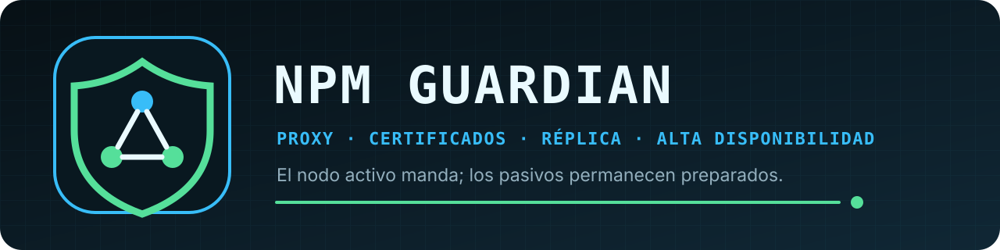

<p align="center">
  
</p>

<p align="center">
  <a href="https://github.com/Ezr43l/npm-guardian-s/actions/workflows/ci.yml"></a>
  
  
  
  <a href="LICENSE"></a>
</p>

<p align="center"><strong>Un Nginx Proxy Manager activo; todos los pasivos preparados.</strong></p>

NPM Guardian replica de forma controlada el estado de Nginx Proxy Manager desde
el nodo que posee la IP flotante hacia los nodos pasivos. La versión actual es
**1.0.4**, la única publicada en este repositorio, y toda la aplicación se
ejecuta en **un único contenedor**.

**[Primer arranque](docs/instalacion-primer-arranque.md)** ·
**[Arquitectura](docs/arquitectura.md)** ·
**[API](docs/api-integraciones.md)** ·
**[Operación](docs/runbook.md)** ·
**[Seguridad de réplica](docs/replicacion-seguridad.md)**

## Instalación rápida en Unraid

La plantilla pública sólo pide cinco conexiones propias de Docker:

1. puerto del panel;
2. directorio `data` del NPM local;
3. directorio `letsencrypt` del NPM local;
4. directorio persistente de NPM Guardian;
5. socket Docker local.

Arranca el contenedor y abre su WebUI. El asistente de primer inicio solicita la
topología, la conexión con Keepalived, la política HTTP/HTTPS y el nombre del
contenedor NPM. Esos valores no se escriben en la plantilla.

En el primer nodo deja vacío el código de incorporación. Guardian genera los
secretos y muestra un código una sola vez. Guárdalo y pégalo al configurar cada
nodo adicional. Así todos comparten la identidad criptográfica necesaria para
replicar, sin copiar ficheros manualmente ni publicar secretos en DockerMan.

La guía completa está en [Instalación y primer arranque](docs/instalacion-primer-arranque.md).

## Instalación con Compose

```sh
cp .env.example .env
# Ajusta únicamente las rutas de los volúmenes y el puerto publicado.
docker compose up -d --build
```

Después abre `http://SERVIDOR:6061/` y completa el mismo asistente. Compose no
crea sidecars ni servicios auxiliares.

## Persistencia

El volumen `/datos` contiene:

- `node.json`: configuración local no secreta del nodo;
- `secrets/session-secret`: cifrado y sesiones compartidas;
- `secrets/cluster-token`: autenticación del protocolo interno;
- `secrets/keepalived-api-token`: integración con Keepalived, si se indicó;
- `guardian.json`: cuenta y configuración funcional replicada;
- estado operativo y respaldos de réplicas.

Los secretos se generan con permisos `0600`. Conserva `/datos` en las
actualizaciones y protégelo como cualquier volumen que contenga credenciales.

## Funcionamiento esencial

- Keepalived determina de forma ternaria qué nodo es activo; una respuesta
  desconocida nunca concede autoridad.
- Sólo el activo autentica usuarios, renueva certificados y emite réplicas.
- Los cambios sensibles requieren quórum del clúster configurado.
- El acceso humano se valida contra una cuenta administradora de NPM. Guardian
  no guarda su contraseña de inicio de sesión.
- El socket Docker queda limitado por código al nombre de contenedor NPM elegido.

## Compatibilidad y migraciones

Los despliegues anteriores que ya proporcionan `NPMG_*` siguen funcionando. Su
configuración aparece en el portal y, al guardarla, se migra a `/datos`; desde
ese momento el fichero persistente es la fuente autoritativa. Una instalación
nueva usa el asistente y no necesita variables funcionales ni montajes de secretos.

La imagen pública prevista es
`ghcr.io/ezr43l/npm-guardian-s:1.0.4`. Hasta que exista una release pública,
puede construirse localmente con `build-image.sh` o mediante Compose.

## Desarrollo

- licencia: Apache-2.0;
- versión única: [`VERSION`](VERSION);
- pruebas: se ejecutan dentro de la fase `tests` del Dockerfile;
- contrato API: [docs/api-integraciones.md](docs/api-integraciones.md);
- arquitectura: [docs/arquitectura.md](docs/arquitectura.md);
- historial: [CHANGELOG.md](CHANGELOG.md).
