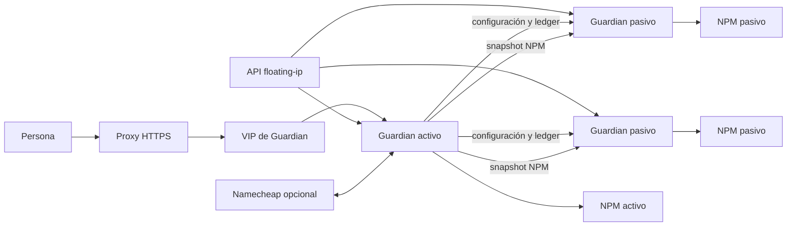
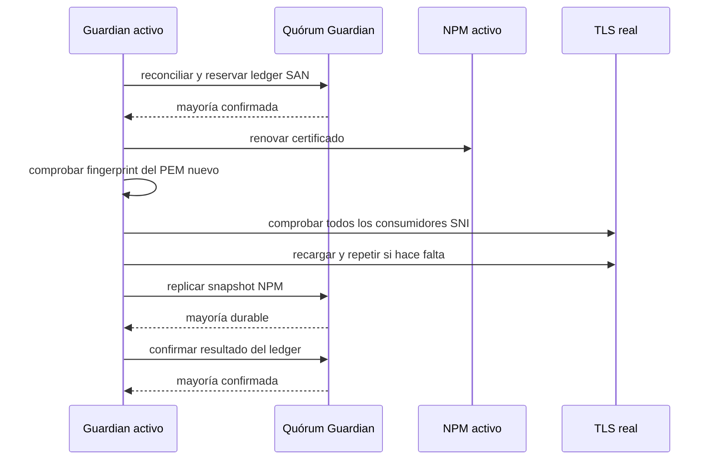

# Arquitectura de NPM Guardian

## Objetivo

NPM Guardian coordina varias instalaciones existentes de Nginx Proxy Manager
sin sustituir sus autoridades:

1. Keepalived/floating-ip decide qué nodo posee la VIP;
2. el NPM de ese nodo sigue siendo la fuente de proxies y certificados;
3. Guardian replica ese estado y coordina, opcionalmente, renovaciones.

Guardian no elige líder. Un error o una respuesta ambigua de la API flotante
produce autoridad desconocida y cierre seguro.

## Topología lógica

La colección se configura; no hay nombres ni direcciones fijados en código. Un
nodo funciona sin redundancia. Dos nodos requieren ambos para mayoría. Tres
nodos proporcionan quórum `2/3` y toleran un miembro indisponible.

`NPMG_NODES` es la declaración autoritativa de membresía. En cada servidor debe
contener exactamente el mismo conjunto de nombres que `NPMG_NODE_NAME` más los
nombres de `NPMG_PEERS`; una diferencia bloquea el arranque. Las direcciones
pueden ser locales a cada nodo, pero la huella SHA-256 de los nombres
normalizados debe coincidir en todo el grupo.

## Autoridad de rol

Guardian consulta `GET /api/direcciones`, selecciona
`NPMG_KEEPALIVED_SERVICE` y obtiene un estado ternario:

| Estado | Portal | Escrituras | Recepción de snapshot |
| --- | --- | --- | --- |
| Activo confirmado | completo y autenticado | posibles si hay quórum | rechazada |
| Pasivo confirmado | vista reducida | rechazadas | permitida desde el activo firmado |
| Desconocido | vista reducida | rechazadas | rechazada |

La decisión se vuelve a consultar antes de enviar, recibir o iniciar una
emisión. La interfaz nunca es la barrera única: cada endpoint aplica rol,
sesión, CSRF, canal y autoridad en el backend.

## Quórum y degradación

El quórum es la mayoría de los miembros configurados, contando al activo. Para
tres miembros es `2/3`.

Se usa para:

- reconciliar configuración, cuenta, 2FA y ledger antes del login o una
  mutación sensible;
- confirmar un cambio de configuración o seguridad;
- reservar una emisión antes de llamar a NPM;
- considerar durable el snapshot posterior a la emisión;
- confirmar el resultado final del ledger.

Con activo y un pasivo disponible, la operación puede alcanzar mayoría aunque
el resultado indique `complete=false` y detalle el miembro ausente. El servicio
queda degradado, no silenciosamente sano. Con sólo el activo no se inicia una
operación sensible; el NPM ya activo puede seguir sirviendo tráfico y las
lecturas públicas siguen disponibles.

Una confirmación interna sólo aporta quórum cuando usa el esquema 3, acredita la
misma huella de membresía y esa huella forma parte del AAD cifrado. El esquema 2
se conserva únicamente para mantener comunicación durante una actualización
escalonada; nunca demuestra el quórum topológico de la versión 1.

El quórum no fusiona bases NPM. La comparación ordinaria conserva la regla de
no sobrescribir un nodo que contiene datos más recientes.

## Bootstrap del primer activo

Todos los nodos vírgenes crean el mismo documento inicial, revisión `1` y sin
cuenta. El activo confirmado sólo lo promueve a revisión `2` después de demostrar
por *majority-read* que ese contenido inicial está respaldado por mayoría. La
promoción se replica a quórum antes de autorizar la primera vinculación. El
primer login exige mayoría, autentica en NPM y replica la cuenta vinculada.

Un pasivo nunca se autoproclama bootstrap. Si los secretos no coinciden, un par
aparece incompatible y no participa. Si no hay mayoría, el acceso inicial se
bloquea en lugar de crear identidades distintas en nodos aislados.

## Estado de Guardian

Hay dos estructuras diferentes:

- **configuración:** el contenido lógico —todo salvo `revision` y `updated_at`—
  debe aparecer en una mayoría; una revisión alta aislada no acredita un cambio;
- **ledger de renovaciones:** estado fusionable; une intentos, fallos,
  agotamiento y reconciliaciones sin permitir que un nodo rezagado borre cuota.

El activo consulta `/api/internal/state`, agrupa por hash canónico del contenido
lógico y sólo acepta un grupo con apoyo igual o superior al quórum. Si una
revisión huérfana es mayor, vuelve a publicar el contenido confirmado con una
revisión superior a la máxima observada (`max + 1`). Ese rebase debe quedar
durable en mayoría antes de autorizar login, otra mutación o una renovación. Si
no existe una mayoría inequívoca, la reconciliación falla cerrada. Se ejecuta
periódicamente aunque el cron de snapshots de NPM esté desactivado.

La topología, rutas, CA y nombre de contenedor son locales y no viajan en
`guardian.json`. La huella de membresía sí acompaña el estado interno; los
identificadores HMAC de los secretos compartidos permiten comprobar
compatibilidad sin exponerlos.

## Portal activo y vista pasiva

`/` y `/index.html` se resuelven según el rol en cada petición:

- activo: aplicación completa, login NPM, Estado, sincronización, certificados,
  configuración y perfil;
- pasivo: salud local, autoridad observada y enlace a `NPMG_PUBLIC_URL`;
- desconocido: diagnóstico mínimo, sin presentar acciones que luego deban
  fallar.

El proxy HTTPS termina TLS para las personas. En el perfil seguro, Guardian
sólo confía en `X-Forwarded-Proto: https` cuando el origen pertenece a
`NPMG_TRUSTED_PROXY_IPS`.

## Plano de datos NPM

El snapshot contiene una copia SQLite coherente y las partes administradas de
Nginx y Certbot. El activo usa la API de backup de SQLite, contrasta que los
artefactos no hayan cambiado durante la captura y genera un manifiesto SHA-256.

El pasivo valida el paquete antes de detener NPM. Antes del primer `rename`
persiste en el journal la decisión de poder completar hacia delante. Publica las
rutas y sólo confirma después de que el contenedor, SQLite y la API de NPM estén
sanos. Si el estado nuevo recuperado no queda sano, fija durablemente la decisión
de rollback antes del primer `rename` inverso, restaura el anterior y verifica su
salud. Una recuperación incierta falla cerrada.

La réplica manual ordinaria puede terminar degradada si alcanza mayoría pero no
todos los receptores. La pantalla debe mostrar por separado `ok` (quórum) y
`complete` (todos).

Las marcas de modificación de Nginx y Certbot no eligen la autoridad: esos
ficheros pueden regenerarse al arrancar un nodo sin que cambie un solo proxy.
Cuando todas las diferencias lógicas de SQLite señalan al mismo miembro,
Guardian lo considera la única fuente coherente. Si ya no posee la VIP, el
activo solicita su snapshot estable mediante el canal interno autenticado, lo
aplica con backup y journal mientras comprueba que conserva el rol, y lo
redistribuye. Los artefactos viajan con esa configuración y no compiten contra
ella por su `mtime`.

Cuando el inventario ya coincide no se detiene NPM: el activo envía un heartbeat
autenticado y ligado a la topología. Un pasivo sólo declara `ready` si dispone de
base NPM válida, contenedor existente y en ejecución, socket Docker disponible,
API NPM accesible y una réplica o heartbeat topológicamente verificado y
reciente. `/api/health` por sí solo no acredita esas condiciones.

## Renovación opcional

La cuota de emisión usa el conjunto SAN exacto. El límite de fallos usa
identificadores DNS base, por lo que wildcard y apex comparten bucket. Un
timeout queda indeterminado y bloquea otra emisión solapada hasta reconciliar.

El TLS real se contrasta por fingerprint DER en todos los `proxy_host`,
`redirection_host` y `dead_host` activos asociados. Sin consumidor verificable,
con TLS anterior o sin quórum de snapshot/ledger, la emisión puede haber
ocurrido, pero la renovación completa sigue pendiente.

Namecheap sólo interviene para DNS-01 de Namecheap y puede permanecer
desactivado. Otros certificados no dependen de su IP ni de sus credenciales.

## Límites deliberados

- Los snapshots son asíncronos; puede haber pérdida del intervalo posterior al
  último snapshot si el activo desaparece.
- No hay fusión automática cuando las diferencias lógicas tienen varios
  ganadores; la recuperación automática exige una única fuente verificable.
- El servidor integrado no termina TLS; necesita proxy o un perfil LAN
  explícitamente aceptado.
- El cifrado interno no oculta IP, ruta, tamaño ni tiempo a la red.
- El socket Docker conserva una capacidad elevada y lo monta el único
  contenedor de NPM Guardian. El cliente integrado limita sus operaciones al
  contenedor configurado y a órdenes fijas; esto reduce errores, pero no
  convierte el socket en un recurso sin privilegio.
- Un healthcheck de Guardian no demuestra por sí solo que un nodo esté listo
  para recibir la VIP; también importan NPM, Docker, quórum y réplica reciente.
